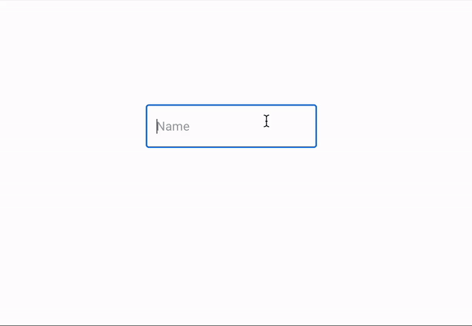

# wrong-input-sentence-fixer

Chrome extension for mapping one qwerty keyboard to another.
Helping with the annoying situation, when one forget to switch input language.

This extension is very Alpha, so if you have more ideas I will love to hear (:

## Supported languages:

- English
- Hebrew
- Will add more soon...
